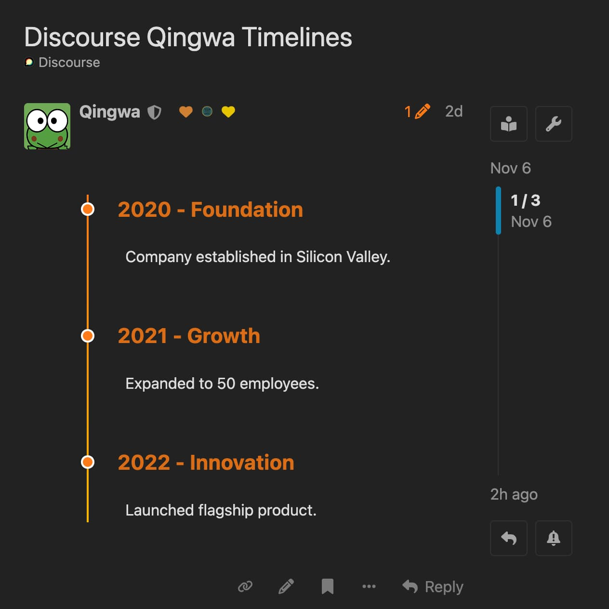
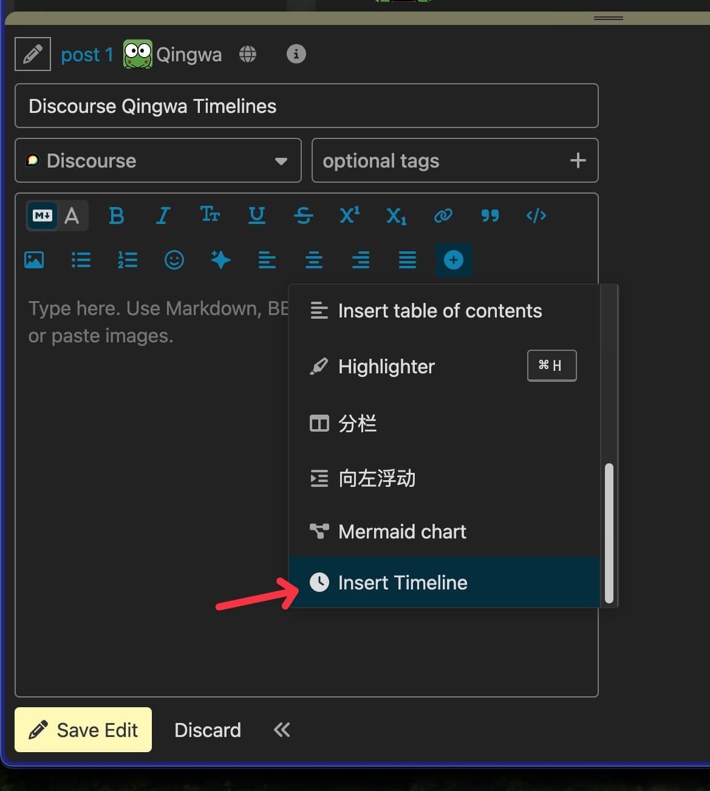
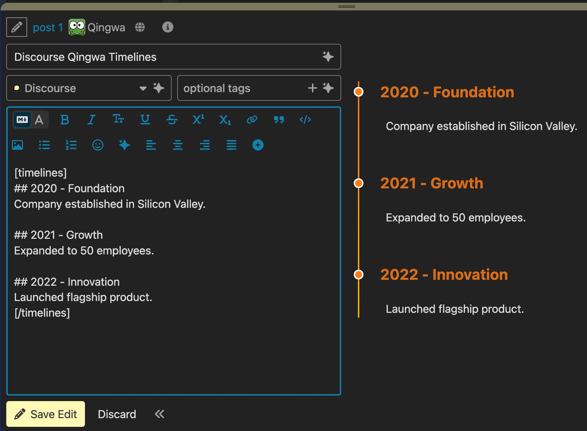

# discourse-qingwa-timelines

A Discourse theme component that implements custom BBCode `[timelines]...[/timelines]` for creating beautiful timeline layouts.


:eyeglasses:	Preview	https://meta.appinn.net/t/topic/76953  
:hammer_and_wrench:	Repository	https://github.com/scavin/discourse-qingwa-timelines/

English | [中文](README_CN.md)

---

## Features

- **Custom BBCode**: Use `[timelines]...[/timelines]` tags to create timeline layouts
- **Visual Design**: Single vertical gradient line (orange #ff7a18 → gold #ffb800) on the left with content on the right
- **Minimalist**: Clean, transparent background with no unnecessary decorations
- **Markdown Support**: Preserves all Markdown formatting (headings, lists, bold, etc.) inside timelines
- **Multi-purpose**: Works for timelines, step-by-step guides, chapter divisions, and more
- **Responsive**: Mobile-friendly layout with adaptive spacing
- **Theme Compatible**: Supports both light and dark modes
- **Safe**: Prevents XSS injection and handles HTML securely
- **No Dependencies**: Uses only Discourse native APIs

## Screenshots

### Published Timeline


### Composer Toolbar Button


### Markdown Editor


## Installation

### Method 1: Install from Git Repository (Recommended)

1. Go to your Discourse Admin panel
2. Navigate to **Customize** → **Themes** → **Install**
3. Click **"From a git repository"**
4. Enter the repository URL:
   ```
   https://github.com/scavin/discourse-qingwa-timelines
   ```
5. Click **Install**
6. Enable the component on your active theme

### Method 2: Manual Upload

1. Download or clone this repository
2. Go to your Discourse Admin panel
3. Navigate to **Customize** → **Themes** → **Install**
4. Click **"Upload a theme"**
5. Upload the entire folder as a ZIP file
6. Enable the component on your active theme

## Usage

### Using Toolbar Button (Recommended)

1. Open the post editor
2. Click the **"⋮" (More)** button in the toolbar
3. Select **"Insert Timeline"**
4. Edit the timeline content
5. Publish your post

The toolbar button will automatically insert the correct `[timelines]` tags without them being escaped by the new Discourse editor.

### Manual Input (For Legacy Editor)

Wrap your content with `[timelines]` and `[/timelines]` tags in your posts:

```
[timelines]
## January 2024 - Project Launch
The project was officially initiated, and the team was formed...

## March 2024 - First Release
Core functionality development completed...

## June 2024 - Version 2.0
Added new features:
- Feature A
- Feature B
- Feature C
[/timelines]
```

**Note**: The new Discourse editor may automatically escape manually typed square brackets. If you experience issues with manual input, please use the toolbar button instead.

## Example Use Cases

### Timeline

```
[timelines]
## 2020 - Foundation
Company established in Silicon Valley.

## 2021 - Growth
Expanded to 50 employees.

## 2022 - Innovation
Launched flagship product.
[/timelines]
```

### Step-by-Step Guide

```
[timelines]
## Step 1: Installation
Download and install the software from our website.

## Step 2: Configuration
Set up your preferences in the settings panel.

## Step 3: Launch
Click the start button to begin using the application.
[/timelines]
```

### Chapter Divisions

```
[timelines]
## Chapter 1: The Beginning
Once upon a time, in a land far away...

## Chapter 2: The Journey
The hero embarked on an epic quest...

## Chapter 3: The Resolution
After many trials, peace was restored.
[/timelines]
```

## Customization

After installing the component, you can customize the timeline colors in the Discourse admin panel:

1. Go to **Admin** → **Customize** → **Themes**
2. Select your active theme and click **Edit CSS/HTML**
3. Find **discourse-qingwa-timelines** in the **Theme Components** section
4. Click **Settings**

### Available Settings

- **timeline_gradient_start**: Gradient line start color (top), default `#ff7a18`
- **timeline_gradient_end**: Gradient line end color (bottom), default `#ffb800`
- **timeline_heading_color**: Heading text color, default `#d96d14`
- **timeline_dot_color**: Timeline node dot color, default `#ff7a18`
- **timeline_heading_color_dark**: Heading color in dark mode, default `#ff9854`
- **timeline_dot_border_color_dark**: Dot border color in dark mode (leave empty to use theme default)

### Example Color Schemes

**Blue Theme:**
- Gradient start: `#1e90ff`
- Gradient end: `#00bfff`
- Heading color: `#1873cc`
- Dot color: `#1e90ff`

**Green Theme:**
- Gradient start: `#2ecc71`
- Gradient end: `#27ae60`
- Heading color: `#229954`
- Dot color: `#2ecc71`

**Purple Theme:**
- Gradient start: `#9b59b6`
- Gradient end: `#8e44ad`
- Heading color: `#7d3c98`
- Dot color: `#9b59b6`

**Red/Pink Theme:**
- Gradient start: `#e74c3c`
- Gradient end: `#c0392b`
- Heading color: `#a93226`
- Dot color: `#e74c3c`

## Compatibility

- **Discourse Version**: 2.8.0 or higher
- **Other BBCodes**: Does not conflict with `[details]`, `[quote]`, `[note]`, `[wrap]`, etc.
- **Theme Support**: Works with any Discourse theme
- **Browser Support**: All modern browsers

## Security

- Prevents XSS injection
- Sanitizes user input
- Uses safe HTML structures
- No inline event handlers

## License

MIT License - see LICENSE file for details

## Support

For issues, questions, or feature requests, please visit:
- GitHub Issues: https://github.com/scavin/discourse-qingwa-timelines/issues

## Contributing

Contributions are welcome! Please feel free to submit pull requests or open issues.

---

## Development

### File Structure

```
discourse-qingwa-timelines/
├── javascripts/
│   └── discourse/
│       └── initializers/
│           └── qingwa-timelines.js.es6
├── common/
│   └── common.scss
├── locales/
│   ├── en.yml
│   ├── zh_CN.yml
│   ├── zh_TW.yml
│   ├── de.yml
│   ├── es.yml
│   ├── fr.yml
│   ├── ja.yml
│   ├── ko.yml
│   └── ru.yml
├── settings.yml
├── about.json
├── README.md
└── LICENSE
```

### Technical Details

- **Initializer**: Uses Discourse's `decorateCooked` API to parse and render timelines
- **Idempotency**: Parser is idempotent and won't create nested structures on re-render
- **Safety**: Skips code blocks, pre blocks, and blockquotes to prevent unintended parsing
- **Multiple Timelines**: Supports multiple timeline blocks in the same post
- **Multilingual**: Supports interface translations in 9 languages

### Changelog

**v0.3.0** (Composer Toolbar Button)
- Added composer toolbar button for easy timeline insertion
- Solves the issue of new Discourse editor auto-escaping square brackets
- Supports wrapping selected text in timeline tags
- Added localization support for 9 languages
- Button appears in the "More" menu with a clock icon

**v0.2.0** (Customizable Colors Update)
- Added configurable color settings via admin panel
- Six customizable color options (gradient start/end, heading colors, dot colors)
- Support for separate dark mode colors
- Example color schemes in documentation
- Maintained backward compatibility with default colors

**v0.1.0** (Initial Release)
- Custom BBCode `[timelines]` implementation
- Gradient vertical line design
- Markdown preservation
- Light/dark mode support
- Mobile responsive layout
- XSS protection
